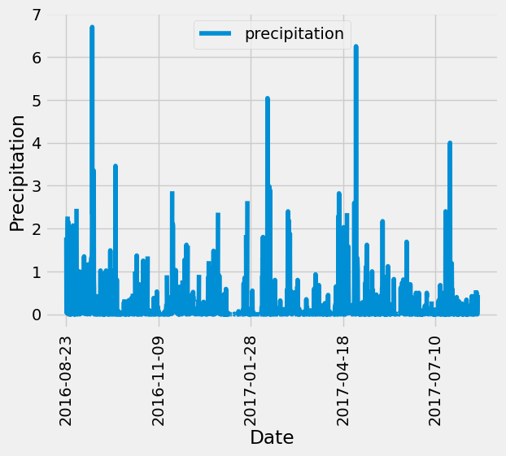
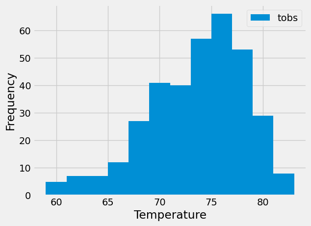

# Overview
This project analyzes the climate data of Honolulu, Hawaii. The goal is to explore the dataset using Python and SQLAlchemy and then develop a Flask API to present the results. The following sections detail the steps taken to perform the analysis and build the application.

## Part1: Analysis and Exploration of Climate Data
In this part, Python, SQLAlchemy ORM, Pandas, and Matplotlib are employed to perform basic climate data analysis and visualization.

### Setup and Database Connection
* A connection to the SQLite database is established using SQLAlchemy's create_engine() function.
* The database schema is reflected using SQLAlchemy's automap_base(), which maps the tables and saves references to classes named station and measurement.
* A session is created to link Python to the database, facilitating query execution.

### Precipitation Analysis
* The most recent date in the dataset is identified.
* Precipitation data for the previous 12 months from this date is queried.
* The query retrieves the "date" and "prcp" columns and loads them into a Pandas DataFrame with explicit column names.
* The DataFrame is sorted by date and visualized using the plot method.
* Summary statistics for the precipitation data are printed using Pandas.

### Station Analysis
* A query is designed to calculate the total number of stations in the dataset.
* Another query identifies the most active station by determining which station has the highest number of observations(that is, highest number of rows). 
* A query calculates the minimum, maximum, and average temperatures for the most active station.
* Temperature observation data (TOBS) for the previous 12 months is queried and plotted as a histogram.

## Part2: Development of Climate App
A Flask API based on the climate analysis have been developed. The API endpoints are as follows:
Available Routes
* /: The homepage lists all available API routes.

* /api/v1.0/precipitation:
    * Retrieves the last 12 months of precipitation data.
    * Converts the query results into a dictionary with the date as the key and precipitation (prcp) as the value.
    * Returns the dictionary as a JSON response.

* /api/v1.0/stations:   
    * Return a JSON list of all stations from the dataset.
* /api/v1.0/tobs:
    * Queries the dates and temperature observations of the most-active station for the last 12 months.
    * Returns the results as a JSON list.
* /api/v1.0/<start> and /api/v1.0/<start>/<end>:
    * Returns a JSON list of the minimum, average, and maximum temperatures for a specified date range.
    * For a start date, calculates TMIN, TAVG, and TMAX for all dates greater than or equal to the start date.
    * For a start and end date, calculates TMIN, TAVG, and TMAX for dates within the range, inclusive.

## Files and Folders:
The repository is organized into the main "SurfsUP" folder, which contains the following essential files and subfolders:
### Folders:
* Resources:
This folder holds the primary data files used in the analysis and Flask API:
* hawaii.sqlite: The SQLite database containing climate data.
* hawaii_measurements.csv: A CSV file with data on station, date, precipitation and temperature(tobs).
* hawaii_stations.csv: A CSV file listing the weather stations, name, latitude, longitude, elevation.
### Files:
* app.py: The main script for running the Flask API. This file sets up the application and defines all routes for data retrieval and JSON responses.
* climate_starter.ipynb: A Jupyter Notebook that contains the Python code for performing the climate analysis.

## Technologies and Tools Used:
Programming Languages: Python
Libraries: Pandas, NumPy, Matplotlib, SQLAlchemy, Flask
Database: SQLite
Development Environemnt: Jupyter Notebook, Visual Studio Code

